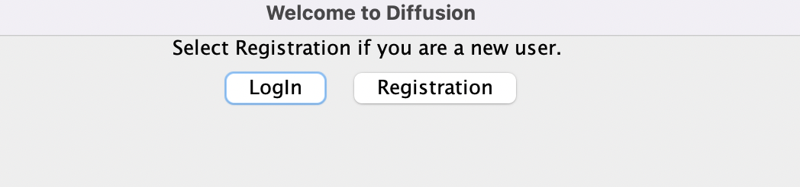
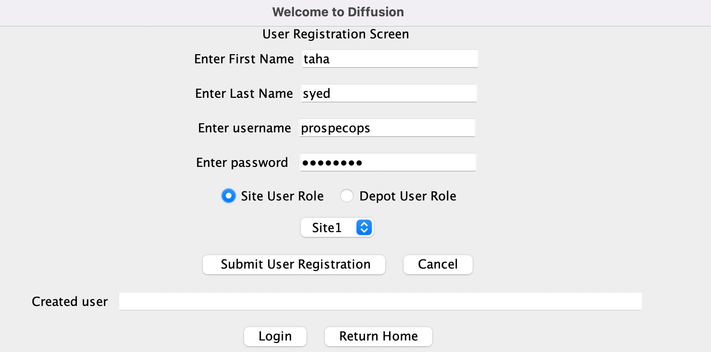
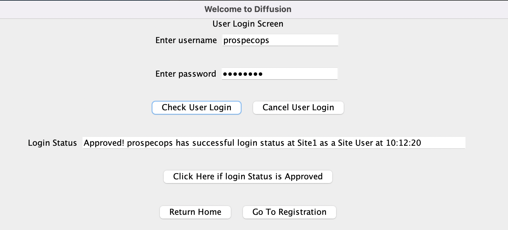
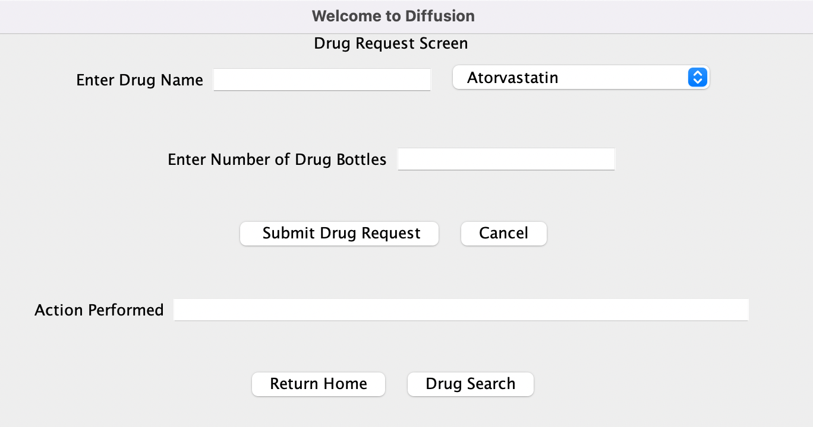
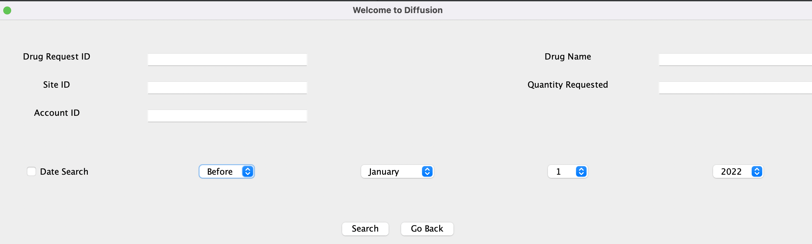
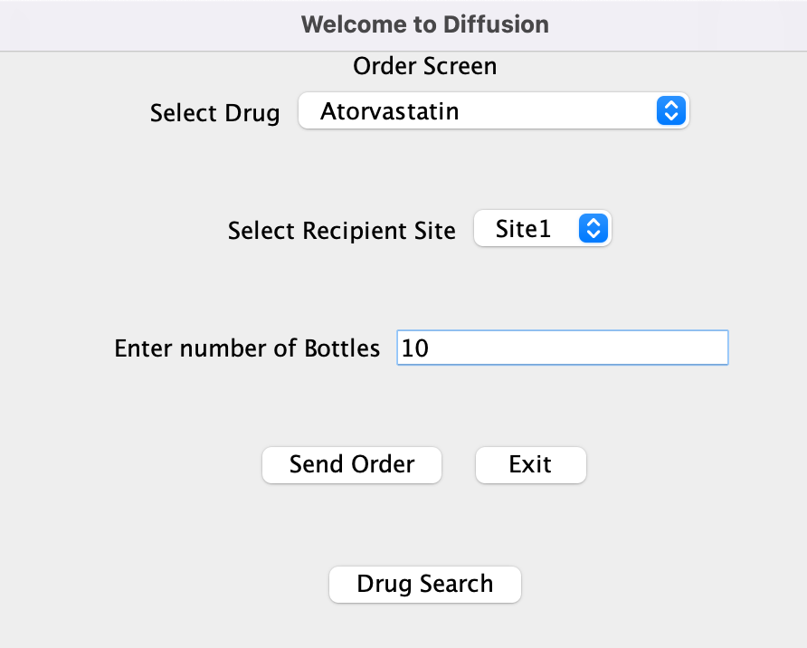

# Welcome to Diffusion

This is the repository for the project Diffusion of group 123. This project contains the starter code required to run
the program. It also contains some tests in order to test the program.

This document also contains some instructions which explain how to use the program.

## The following sections wil be covered in this document
- [ ] Home Screen and User Registration - Taha
- [ ] User Login Screen - Taha
- [ ] Drug Request Screen - Taha
- [ ] Drug Search Screen - Owen
- [ ] Drug Order Screen  - Joshua
- [ ] Inventory Checker(Request Request) - Khang
- [ ] Testing 
- [ ] Design Patterns

Presentation link: https://docs.google.com/presentation/d/1GYFGUaJPnMJFPHOOkQpkMRDOHfbERJV8x7qUJtbpNmc/edit#slide=id.g1b3a0494ccb_0_0

## Home Screen

* After starting the program, a home screen is shown with a "Login" and "Registration" button.
* The Registration screen will ask for your first name, last name, username, password, and whether you are a site or a 
depot user.

## Registration screen

* The Registration screen will ask for your first name, last name, username, password, and whether you are a site or a 
depot user.

## Login screen

* The Login screen lets you log into your existing account with the same username and password that you registered with.
* After entering username and password, click "Check User Login".
* If login status bar respond "Approved", Choose "Click Here if login status" to log in.

## Drug Request Screen

* The user will then be able to requests drug, they can use the drop down menu to see the lists

## Drug Request Search Screen

* Users are able to search for drug requests matching certain criteria, providing them with a robust method to see and filter past drug requests.
* Users may specify the following search parameters:
  * The ID of the drug request
  * The ID of the site which ordered the drug
  * The ID of the account which made the request
  * The name of the requested drug
  * The quantity requested (this value must be an integer)
  * The date the request was made (optional, must be a valid date)
    * The user may search for requests made before, on, or after the specified date
* Gracefully handles invalid input and lets users know what went wrong.

## Drug Order Screen

* The depot user is able to fulfill drug requests and accordingly adjust database inventories for sites and their depot.
* The depot user provides site recipient, drug name, through a dropdown and drug amount through text panel.

## Design Patterns
* Factory
 * Examples of this design pattern can be found in the packages user_registration, user_login, and site_drug_request. Then navigate to the entity and ports folder. There you can see we have methods which allow for the construction of the object without exposing the creation logic to the client refer to the newly created objects using a common interface, such as UserRegistration.
* Dependecy Inversion
 * This is seen in all Presenter, View Model, Screen, and Controller interactions, as well as in many other places throughout the code. For instance, the presenter in the user_registration user case does not depend on the lower level modules of the screen; instead, it make use of interfaces to allow for abstractions and communication of information between them, using UserPresenterOutputBoundary.
* Facade 
 * This design pattern was implemented in the MainFrame class. This class has many moving parts, as it has several listeners for buttons placed on the various screens. This pattern allows for navigation between the various subsystem screens which make up the program and allows for all our use cases to be fully integrated with one another.

## Test Cases

### receive_request package
All methods are tested except for a few basic getters and setters.

### drug_fulfill package
* simple tests were used on the CommonDrugFulfill and DrugFulfillRequestModel to ensure getters and setters were
* working correctly.
* More involved tests for DrugFulfillInteractor were used to insure the use cases ability to absorb user input and
* properly adjust databases using the site and depot data access interface.

### user_registration and user_login use_case
* complete test of the use case interactor engine and all the parts that plug into it. This allowed us to test that data
* can be provided as input and it can go and be processed by the interactor using the API rules and be stored in a csv 
* file and then be returned as an output

### drug_search.frameworks_drivers and drug_search.interface_adapters
* Tests if the database accessor can accurately deserialize a drug request from a .csv database file.
* Tests if the drug search controller can handle invalid input and communicate what went wrong to the user.
* Things which were not tested:
  * The use case itself—the way it's coded makes it difficult to direct it to a test .csv file.
  * How the GUI looks across different platforms/device resolutions, beyond that it works on all group members' computers.
